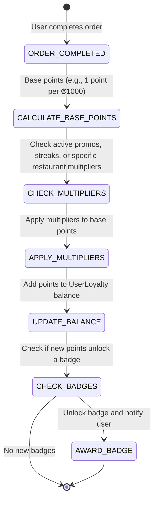

# Gamification & Content

This document outlines the architecture, state machines, and implementation details for Gamification (Badges, Streaks, Loyalty) and Content (Video/Story Menus, Photo-First Reviews) in FastEat Client V2.

## 1. Gamification & Loyalty Engine

### 1.1. Architecture & Event-Driven Design
*   **Technology:** Supabase Edge Functions or a dedicated backend service listening to database triggers (e.g., `orders` table inserts).
*   **Data Model:**
    *   `UserLoyalty`: User ID, Points Balance, Current Streak, Longest Streak, Last Order Date.
    *   `UserBadges`: User ID, Badge ID, Earned At.
    *   `LoyaltyTransactions`: ID, User ID, Points Earned/Spent, Reason (e.g., "Order Completed", "Photo Review Uploaded"), Created At.

### 1.2. State Machine: Loyalty Points Calculation

### 1.3. "Local Explorer" Badges & Achievements
*   **Concept:** Reward users for trying independent, local restaurants instead of just big chains.
*   **Implementation:**
    *   Tag restaurants in the database as "Local Independent" or "Chain".
    *   When an order is completed, check the restaurant's tags.
    *   If the user orders from 5 different "Local Independent" restaurants, award the "Neighborhood Hero" badge.

### 1.4. Streaks & Mystery Rewards
*   **Concept:** Ordering 3 times in a week unlocks a "Mystery Box" (e.g., free delivery, free dessert, 15% discount).
*   **Implementation:**
    *   Track the `Last Order Date` and `Current Streak` in the `UserLoyalty` table.
    *   If the user orders within 7 days of their last order, increment the streak.
    *   If the streak reaches a multiple of 3, generate a random reward (using a weighted probability distribution) and add it to the user's account.

## 2. Content: Video/Story-Style Menus

### 2.1. Architecture & Streaming
*   **Technology:** HLS (HTTP Live Streaming) for adaptive bitrate video delivery, ensuring smooth playback on varying network conditions.
*   **Storage:** Cloud storage (e.g., AWS S3, Google Cloud Storage) with a CDN (Content Delivery Network) for fast global access.
*   **UI Component:** A custom React component that mimics Instagram Stories or TikTok, allowing users to swipe vertically through short video clips.

### 2.2. Implementation Details
*   **Lazy Loading:** Only load the first video in the feed initially. Use Intersection Observers to preload subsequent videos as the user scrolls near them.
*   **Autoplay & Mute:** Autoplay videos silently by default. Provide a clear, accessible button to unmute.
*   **Performance Optimization:** Compress videos aggressively (e.g., 720p, 30fps, low bitrate) to minimize bandwidth usage and loading times.

## 3. Content: Photo-First Reviews

### 3.1. Concept
Incentivize users to upload high-quality photos of their food by giving them loyalty points. This crowdsources better imagery for the platform and builds trust.

### 3.2. Workflow: Uploading a Photo Review
1.  **Prompt:** After an order is delivered, send a push notification or display an in-app prompt asking the user to rate their meal and upload a photo.
2.  **Upload:** The user selects a photo from their gallery or takes a new one.
3.  **Processing:** The app compresses the image client-side before uploading it to cloud storage.
4.  **Moderation (Optional):** Use an AI image moderation service (e.g., AWS Rekognition) to automatically flag inappropriate content before it goes live.
5.  **Reward:** Once the photo is approved (or immediately if moderation is skipped), award the user loyalty points and notify them.
6.  **Display:** Display the photo prominently on the restaurant's menu page, prioritizing recent, high-quality user photos over stock images.

## 4. Full-Stack Implementation Requirements

To fully realize these Gamification and Content features beyond client-side mocks, the following backend infrastructure is required:

### 4.1. Supabase Database Updates
- [x] **`user_gamification` Table**
  - **Schema:** `user_id` (uuid, PK), `total_points` (int), `current_streak` (int), `longest_streak` (int), `last_order_date` (timestamp).
  - **Implemented in:** `fast-eat-api-nestjs/migrations/035_v2_innovation_backend_features.sql`
- [x] **`user_badges` Table**
  - **Schema:** `id` (uuid, PK), `user_id` (uuid, FK), `badge_id` (varchar), `earned_at` (timestamp).
  - **Implemented in:** `fast-eat-api-nestjs/migrations/035_v2_innovation_backend_features.sql`
- [x] **`order_reviews` Table**
  - **Schema:** `id` (uuid, PK), `order_id` (uuid, FK), `user_id` (uuid, FK), `rating` (int), `photo_url` (text), `status` (pending_moderation, approved, rejected), `created_at` (timestamp).
  - **Implemented in:** `fast-eat-api-nestjs/migrations/035_v2_innovation_backend_features.sql`
- [x] **`restaurant_story_videos` Table**
  - **Schema:** `id` (uuid, PK), `branch_id` (uuid, FK), `item_id` (uuid, FK), `video_url` (text), `active` (boolean), `created_at` (timestamp).
  - **Implemented in:** `fast-eat-api-nestjs/migrations/035_v2_innovation_backend_features.sql`
- [x] **Storage Bucket:** Create a Supabase Storage bucket named `review-photos` with proper Row-Level Security (RLS) policies.
  - **Implemented in:** `fast-eat-api-nestjs/migrations/035_v2_innovation_backend_features.sql` *(bucket bootstrap; RLS policies remain a Supabase policy task)*

### 4.2. NestJS Backend (`fast-eat-api-nestjs`)
- [x] **New Modules:** `gamification` and `reviews`.
  - **Implemented in:** `src/modules/gamification/gamification.module.ts`, `src/modules/reviews/reviews.module.ts`
- [x] **API Endpoints:**
  - `GET /gamification/:userId/status` - Returns points, streak, and badges.
  - `POST /reviews` - Handles photo upload, creates review, triggers points addition logic securely.
  - `GET /content/stories` - Fetches active story videos for the dynamic feed.
  - **Implemented in:** `src/modules/gamification/gamification.controller.ts`, `src/modules/reviews/reviews.controller.ts`, `src/modules/reviews/reviews.service.ts`
- [x] **Backend Logic Triggers:** Add a listener or trigger in NestJS when an order status reaches `COMPLETED` to evaluate streak increments and badge unlocks using backend logic (preventing client-side cheating).
  - **Implemented in:** `fast-eat-api-nestjs/migrations/035_v2_innovation_backend_features.sql` (`trg_orders_completed_gamification` + `process_order_completed_gamification`)
- [x] **Review Anti-Fraud + Moderation Flow:** Review creation now enforces authenticated ownership + delivered/completed status + one-review-per-order, and moderation transitions award points only on approval.
  - **Implemented in:** `src/modules/reviews/reviews.controller.ts`, `src/modules/reviews/reviews.service.ts`, `src/modules/reviews/dto/reviews.dto.ts`, `fast-eat-api-nestjs/migrations/037_v2_security_hardening.sql`

### 4.3. Client React UI Implementation (`fast-eat-client`)
> **[FRONTEND IMPLEMENTED - BACKEND HANDOFF REQUIRED]**
> All UI files below have been implemented using local state and simulated API delays. 
> **To the Backend Team:** Please connect the mock Zustand stores and mock video endpoints to the real Supabase database tables created in 4.1.

- [x] `src/features/gamification/store/useLoyaltyStore.ts` - Local Zustand store created. Replace local data fetching with React Query hooks pointed at `GET /gamification/:userId/status`.
- [x] `src/features/gamification/components/LoyaltyDashboard.tsx` - UI layout complete.
- [x] `src/features/gamification/components/LoyaltyWidget.tsx` - Banner UI complete.
- [x] `src/features/reviews/components/PhotoReviewModal.tsx` - UI and mock file selection works. Needs the Supabase Storage bucket integration to actually upload the file blob.
- [x] `src/components/OrderTrackingModal.tsx` - Trigger condition mock-ready.
- [x] `src/components/MenuItemCard.tsx` - "Community Photos" overlay added.
- [x] `src/features/content/components/StoryMenuFeed.tsx` - Feed works with mock data. Connect to `GET /content/stories`.
- [x] `src/features/content/components/StoryVideoPlayer.tsx` - HTML5 `<video>` logic completed.
