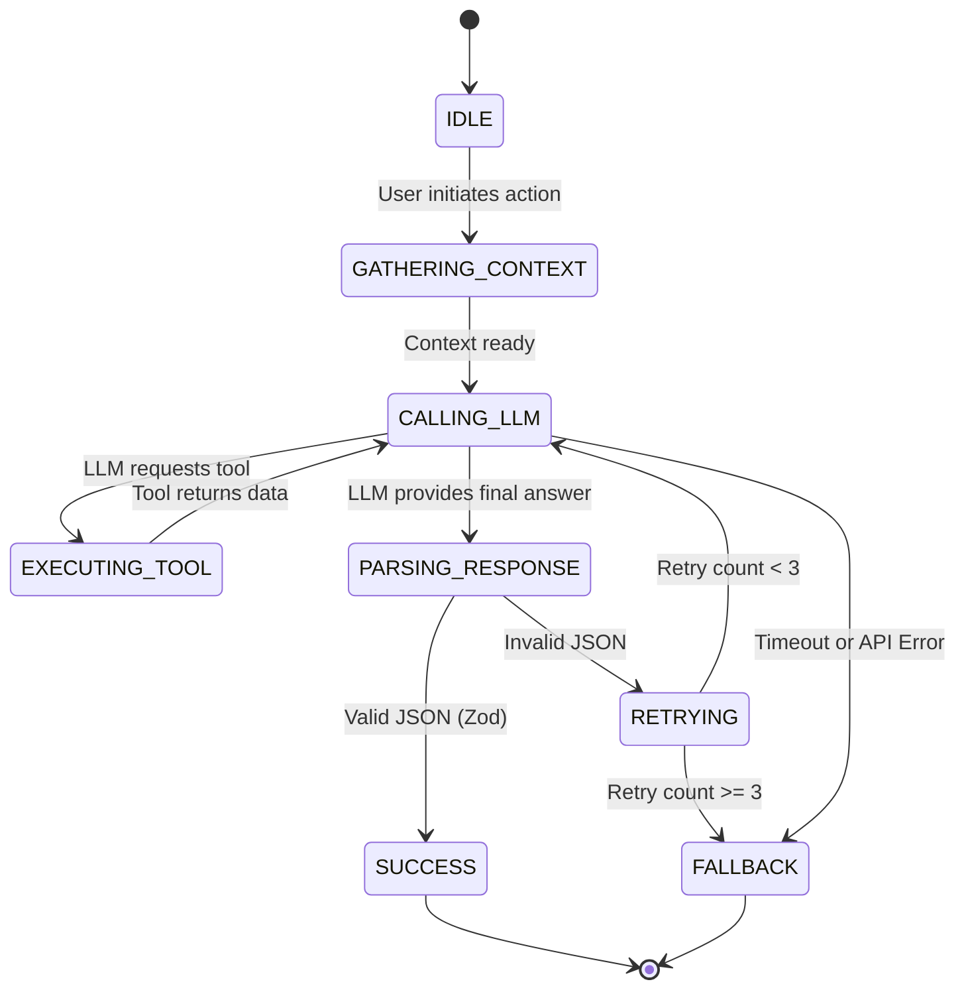

# AI Agent Behaviors & Orchestration

This document details the workflows, tool-based orchestration, prompts, and fallback strategies for the AI features in the FastEat Client V2 Innovation Plan.

## 1. Core AI Agents

### 1.1. "Surprise Me" Matchmaker Agent
*   **Purpose:** To eliminate decision fatigue by selecting a highly-rated meal based on the user's mood, budget, and location.
*   **Inputs:**
    *   `mood` (string): e.g., "Comfort food", "Healthy", "Spicy", "Sweet".
    *   `budget` (number): Maximum amount the user is willing to spend.
    *   `location` (object): Latitude and longitude.
    *   `dietary_profile` (object): User's dietary restrictions (e.g., Vegan, Peanut Allergy).
*   **Tools Available to Agent:**
    *   `search_restaurants(query, location, max_price)`
    *   `get_restaurant_menu(restaurant_id)`
    *   `check_dietary_compliance(item_id, dietary_profile)`
*   **Workflow:**
    1.  Agent receives inputs.
    2.  Agent calls `search_restaurants` with a query derived from the `mood` and `budget`.
    3.  Agent selects the top 3 restaurants and calls `get_restaurant_menu` for each.
    4.  Agent filters items using `check_dietary_compliance`.
    5.  Agent selects the best matching item and returns a structured JSON response (Restaurant ID, Item ID, Justification).
*   **Fallback Strategy:** If the agent fails or takes longer than 5 seconds, fallback to a standard search query based on the `mood` and display the top results.

### 1.2. Dietary Guardian Agent
*   **Purpose:** To validate menu items against a user's strict dietary profile and highlight perfect matches or flag unsafe items.
*   **Inputs:**
    *   `menu_item` (object): Name, description, ingredients (if available).
    *   `dietary_profile` (object): User's restrictions (e.g., Keto, Gluten-Free).
*   **Workflow:**
    1.  Agent receives the menu item and profile.
    2.  Agent analyzes the ingredients and description against known dietary rules.
    3.  Agent returns a structured JSON response: `{ is_safe: boolean, confidence: number, reason: string, estimated_macros: { protein, carbs, fat } }`.
*   **Fallback Strategy:** If the agent fails, default to showing the item without any dietary badges, but display a generic warning: "Please verify ingredients with the restaurant."

### 1.3. Predictive Reorder Engine
*   **Purpose:** To anticipate a user's recurring orders and send timely push notifications or display a "1-Click Order" prompt.
*   **Inputs:**
    *   `user_order_history` (array): Past orders with timestamps, items, and locations.
    *   `current_time` (timestamp).
    *   `current_location` (object).
*   **Workflow:**
    1.  This agent runs asynchronously (e.g., via a cron job or Edge Function triggered on app open).
    2.  Agent analyzes the `user_order_history` for patterns (e.g., "Orders coffee every weekday at 8:30 AM near the office").
    3.  If a pattern matches the `current_time` and `current_location` with high confidence (>80%), the agent generates a personalized prompt: *"¿Lo de siempre? ☕🥐"*.
*   **Fallback Strategy:** If no pattern is found or confidence is low, do not show the predictive prompt.

## 2. Tool-Based Orchestration Framework

We will use a structured orchestration approach (e.g., LangChain or direct LLM calls with function calling/structured outputs via Zod) to manage these agents.

### 2.1. State Machine for Agent Execution

### 2.2. Error Handling & Retries
*   **LLM API Errors (e.g., 503, 429):** Implement exponential backoff (e.g., 1s, 2s, 4s) up to 3 retries.
*   **Parsing Errors (Invalid JSON):** If the LLM returns malformed JSON, send the error back to the LLM and ask it to correct the format (up to 2 retries).
*   **Timeouts:** Set strict timeouts (e.g., 5 seconds for "Surprise Me", 2 seconds for Dietary Guardian). If the timeout is reached, immediately trigger the fallback strategy to ensure a smooth UX.

## 3. Prompts & Guidelines

*   **System Prompts:** Must be concise, define the persona ("You are an expert food concierge for FastEat"), and strictly enforce JSON output formats.
*   **Temperature:** Use low temperature (e.g., 0.1 - 0.3) for analytical tasks (Dietary Guardian) and medium temperature (e.g., 0.6 - 0.7) for creative tasks (Surprise Me).
*   **Context Window Management:** Only send relevant order history or menu items to the LLM to minimize token usage and latency.
