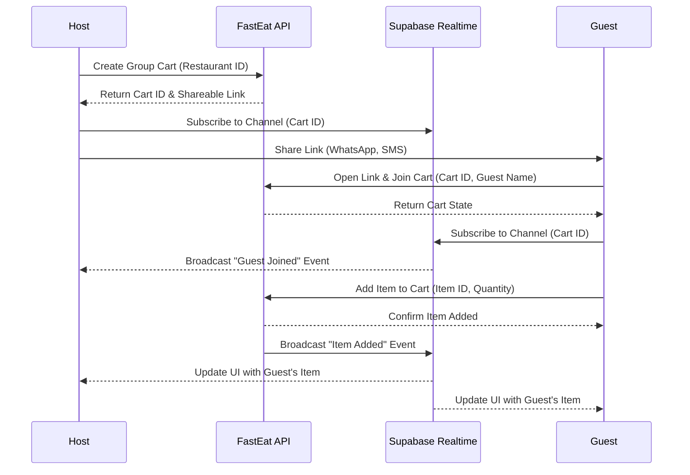
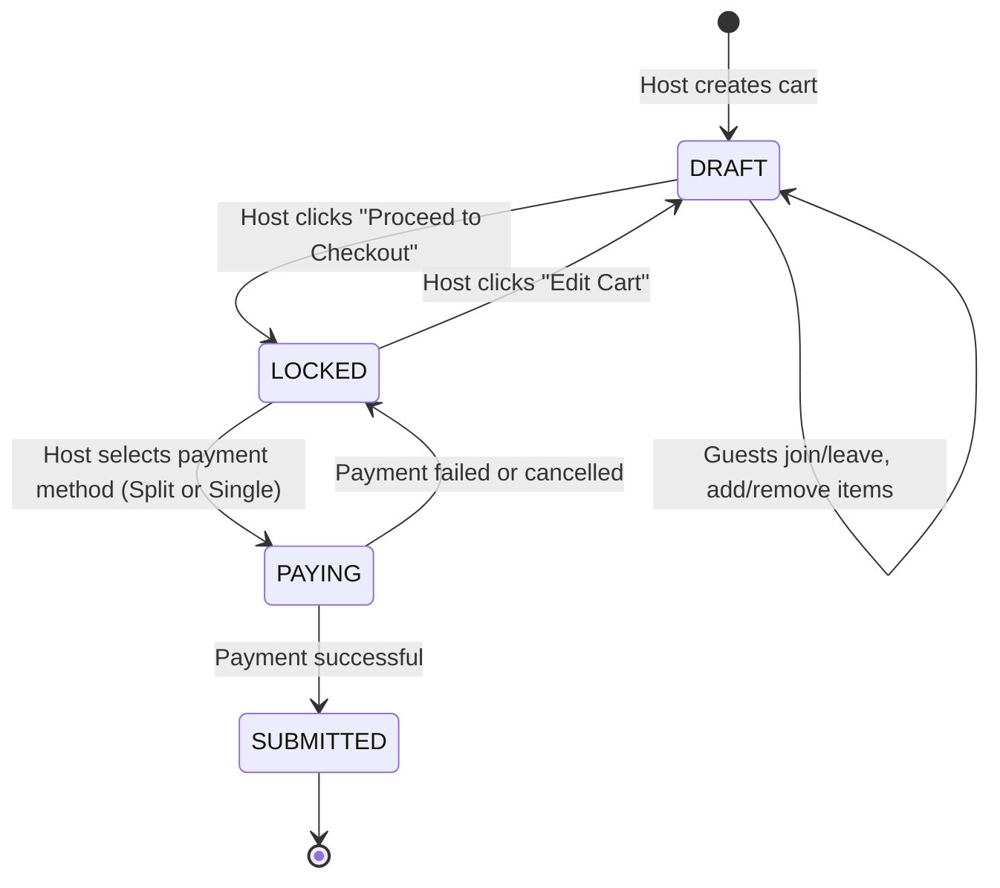

# Social & Group Ordering

This document outlines the architecture, flow charts, and state machines for implementing Group Carts and Native Bill Splitting in FastEat Client V2.

## 1. Group Carts (Shareable Links)

### 1.1. Architecture & Real-time Sync
*   **Technology:** Supabase Realtime (WebSockets) for live synchronization of the cart state across multiple clients.
*   **State Management:** Zustand for local UI state, synced with the Supabase Realtime channel.
*   **Data Model:**
    *   `GroupCart`: ID, Host ID, Restaurant ID, Status (DRAFT, LOCKED, PAYING, SUBMITTED), Created At.
    *   `GroupCartItem`: ID, Cart ID, User ID (who added it), Item ID, Quantity, Options, Price.
    *   `GroupCartParticipant`: ID, Cart ID, User ID, Name, Avatar, Joined At.

### 1.2. Flow Chart: Creating and Joining a Group Cart

### 1.3. State Machine: Group Cart Lifecycle

## 2. Native Bill Splitting (SINPE Móvil Integration)

### 2.1. Splitting Strategies
*   **Equal Split:** Total cost (including delivery and fees) divided equally among all participants.
*   **Itemized Split:** Each participant pays for their specific items, plus an equal share of the delivery fee and taxes.
*   **Custom Amount:** Host manually assigns specific amounts to each participant.

### 2.2. Workflow: Splitting via SINPE Móvil
1.  **Host Selection:** During the `PAYING` state, the Host selects "Split Bill" and chooses a strategy (e.g., Itemized).
2.  **Calculation:** The app calculates each participant's share based on the chosen strategy.
3.  **Notification:** The app generates a unique SINPE Móvil payment request link or QR code for each guest.
4.  **Guest Payment:** Guests receive a push notification or view the request in the app. They tap the link, which opens their banking app pre-filled with the Host's phone number and the exact amount.
5.  **Confirmation:** Guests confirm payment in their banking app. The Host manually marks each guest as "Paid" in the FastEat app (or via an automated webhook if the bank provides an API).
6.  **Final Checkout:** Once all (or sufficient) funds are collected, the Host completes the final checkout using their preferred payment method (e.g., Credit Card) to pay the restaurant.

### 2.3. Conflict Resolution & Edge Cases
*   **Item Out of Stock:** If an item becomes unavailable while a guest is adding it, the API rejects the addition and notifies the guest immediately.
*   **Guest Disconnects:** If a guest loses connection, their items remain in the cart. The Host can manually remove them if necessary.
*   **Host Abandons Cart:** If the Host abandons the cart in the `DRAFT` state for > 30 minutes, the cart is automatically cancelled, and guests are notified.
*   **Unpaid Shares:** If a guest fails to pay their share via SINPE Móvil, the Host can choose to cover the difference or remove the guest's items before final checkout.

## 3. Friend Activity Feed

### 3.1. Concept
A small, non-intrusive feed on the home screen showing recent activity from friends (e.g., "Juan just rated La Taquería 5 stars", "Maria ordered from Sushi Go").

### 3.2. Privacy & Opt-in
*   **Strict Opt-in:** Users must explicitly connect their contacts or invite friends to see activity.
*   **Granular Controls:** Users can choose to hide specific orders or their entire activity history from the feed.

### 3.3. Implementation
*   **Data Fetching:** Fetch the activity feed asynchronously after the main home screen content loads to prevent blocking the critical rendering path.
*   **Caching:** Cache the feed aggressively (e.g., 5-10 minutes) using React Query, as real-time updates are not strictly necessary for this feature.
