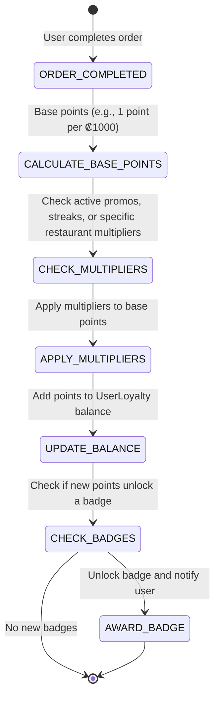

# Gamification & Content

This document outlines the architecture, state machines, and implementation details for Gamification (Badges, Streaks, Loyalty) and Content (Video/Story Menus, Photo-First Reviews) in FastEat Client V2.

## 1. Gamification & Loyalty Engine

### 1.1. Architecture & Event-Driven Design
*   **Technology:** Supabase Edge Functions or a dedicated backend service listening to database triggers (e.g., `orders` table inserts).
*   **Data Model:**
    *   `UserLoyalty`: User ID, Points Balance, Current Streak, Longest Streak, Last Order Date.
    *   `UserBadges`: User ID, Badge ID, Earned At.
    *   `LoyaltyTransactions`: ID, User ID, Points Earned/Spent, Reason (e.g., "Order Completed", "Photo Review Uploaded"), Created At.

### 1.2. State Machine: Loyalty Points Calculation

### 1.3. "Local Explorer" Badges & Achievements
*   **Concept:** Reward users for trying independent, local restaurants instead of just big chains.
*   **Implementation:**
    *   Tag restaurants in the database as "Local Independent" or "Chain".
    *   When an order is completed, check the restaurant's tags.
    *   If the user orders from 5 different "Local Independent" restaurants, award the "Neighborhood Hero" badge.

### 1.4. Streaks & Mystery Rewards
*   **Concept:** Ordering 3 times in a week unlocks a "Mystery Box" (e.g., free delivery, free dessert, 15% discount).
*   **Implementation:**
    *   Track the `Last Order Date` and `Current Streak` in the `UserLoyalty` table.
    *   If the user orders within 7 days of their last order, increment the streak.
    *   If the streak reaches a multiple of 3, generate a random reward (using a weighted probability distribution) and add it to the user's account.

## 2. Content: Video/Story-Style Menus

### 2.1. Architecture & Streaming
*   **Technology:** HLS (HTTP Live Streaming) for adaptive bitrate video delivery, ensuring smooth playback on varying network conditions.
*   **Storage:** Cloud storage (e.g., AWS S3, Google Cloud Storage) with a CDN (Content Delivery Network) for fast global access.
*   **UI Component:** A custom React component that mimics Instagram Stories or TikTok, allowing users to swipe vertically through short video clips.

### 2.2. Implementation Details
*   **Lazy Loading:** Only load the first video in the feed initially. Use Intersection Observers to preload subsequent videos as the user scrolls near them.
*   **Autoplay & Mute:** Autoplay videos silently by default. Provide a clear, accessible button to unmute.
*   **Performance Optimization:** Compress videos aggressively (e.g., 720p, 30fps, low bitrate) to minimize bandwidth usage and loading times.

## 3. Content: Photo-First Reviews

### 3.1. Concept
Incentivize users to upload high-quality photos of their food by giving them loyalty points. This crowdsources better imagery for the platform and builds trust.

### 3.2. Workflow: Uploading a Photo Review
1.  **Prompt:** After an order is delivered, send a push notification or display an in-app prompt asking the user to rate their meal and upload a photo.
2.  **Upload:** The user selects a photo from their gallery or takes a new one.
3.  **Processing:** The app compresses the image client-side before uploading it to cloud storage.
4.  **Moderation (Optional):** Use an AI image moderation service (e.g., AWS Rekognition) to automatically flag inappropriate content before it goes live.
5.  **Reward:** Once the photo is approved (or immediately if moderation is skipped), award the user loyalty points and notify them.
6.  **Display:** Display the photo prominently on the restaurant's menu page, prioritizing recent, high-quality user photos over stock images.
